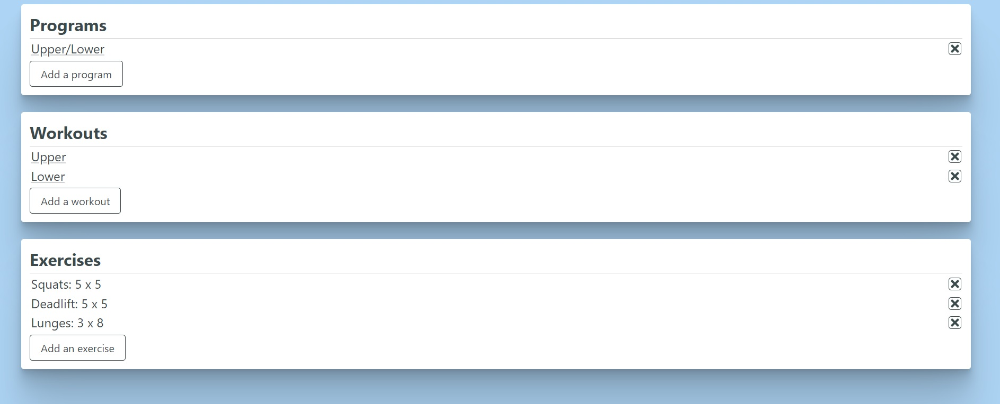
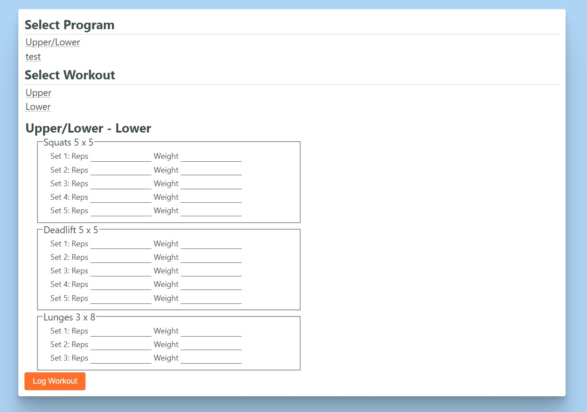
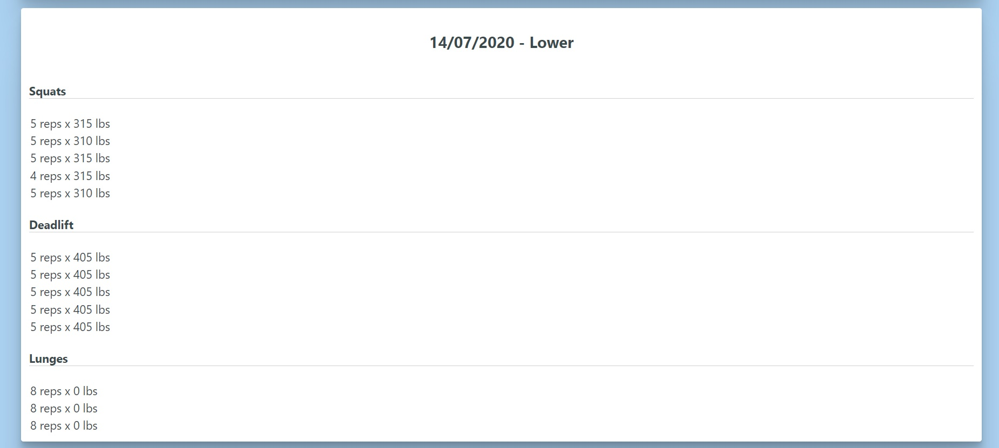

# Lift Simple
## [Live App](https://lift-simple.com/)
Lift Simple is a SPA designed to allow you to create, track, and look at your workouts.
<br>








## Tech
Lift Simple is a full stack application built with the PERN stack. <br>

The front end is hosted using Vercel and authentication is handled by auth0. The backend is hosted on heroku 
with a PostgreSQL database.

## Run locally

```
$ git clone https://github.com/hmaiermack/lift-simple.git
$ cd lift-simple
$ npm i
$ npm start
```
